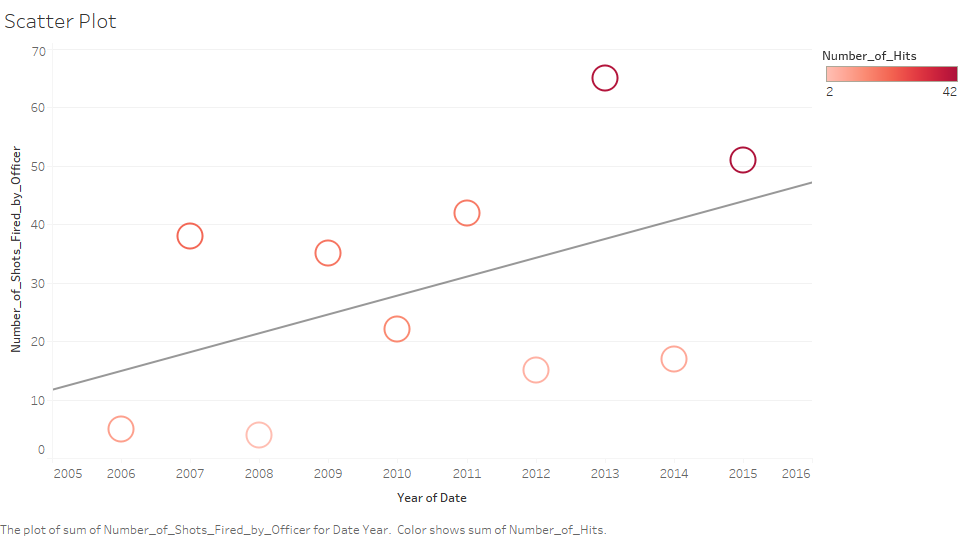

<center></center>

#**Introduction**
For this project, we will be using three different data sets. The csvs that we will be using are "OIS_Dataset_Incidents.csv", "OIS_Dataset_Officers", and "OIS_Dataset_Subjects.csv". These datasets involve cases with incidents, police officers, and subjects within Austin, TX. 
The first dataset is "OIS_Dataset_Incidents.csv". Mainly describes when, where, and how the incident occured. 
The second dataset is "OIS_Dataset_Officers". Here describes who the officers were during those incidents, which includes their age, gender, etc.
The third dataset is "OIS_Dataset_Subjects.csv". This describes the subjects who were involved in the incidents, including their race/ethnicity, age, etc.

<b>To download the data needed for this project:</b>

1. Click or copy/paste this link to your web browser https://data.world/ryanmak/s-17-dv-final-project
2. Download the files "OIS_Dataset_Incidents.csv", "OIS_Dataset_Officers", and "OIS_Dataset_Subjects.csv".


#**R Configuration**
Below is our sessionInfo(). 

```{r}
sessionInfo(package=NULL)
```

#**ETL**

Here we have the ETL code to clean our datasets. These datasets have already been cleaned.

##*OIS_Dataset_Incidents*

```{r}
source("../01 Data/ETL.OIS_Dataset_Incidents.R")
```

##*OIS_Dataset_Officers*

```{r}
source("../01 Data/ETL.OIS_Dataset_Officers.R")
```

##*OIS_Dataset_Subjects*

```{r}
source("../01 Data/ETL.OIS_Dataset_Subjects.R")
```

#**Shiny Visualizations**

<b>This is the link to the Shiny Apps that was published for our project:</b>
https://jenniferchung.shinyapps.io/finalproject/

```{r}
require(ggplot2)
require(dplyr)
require(shiny)
require(shinydashboard)
require(data.world)
require(readr)
require(DT)
require(leaflet)
require(plotly)
data.world(propsfile = "www/.data.world")
source("../02 Shiny/server.R")
source("../02 Shiny/ui.R")
```

##*Type of Case Call Versus Subject Age per Day of Week*

<center></center>

This is a box plot that displays the ages of subjects in officer involved shootings. This is separated by the crime that the police were alerted for initially. The color shows the date in which the shootings happened. <b>THE MOST COMMON CALL THAT LEADS TO SHOOTINGS IS DISTURBANCES. ADITIONALLY, CERTAIN CRIMES ARE MORE COMMON ON THE WEEKENDS SUCH AS BURGLARY.</b>

##*Number of Shots Fired by Police Force per Race*

<center></center>

This histogram displays the count of bullets shot by police officers and the frequency/count as well. This histogram shows that most shootings involve low number of bullets. Aditionally, this histogram shows the race of the subjects involved in the shootings which allows us to discern valuable information about race relations and police. <b>FROM A RACIAL PERSPECTIVE, ASIANS ARE THE LEAST LIKELY TO BE INVOLVED IN SHOOTINGS, FOLLOWED BY HISPANICS, BLACKS, THEN WHITES. THIS DOES NOT ACCOUNT FOR POPULATION SIZES.</b>

##*Number of Shots fired per Year*

<center></center>

This scatterplot shows the gradual trend with the increase of shots fired in the Austin area over time. Although this is not a strong correlation, the trend indicates a worrying trend with increases in shooting frequency as well as injuries from shootings.

##*Accuracy of Police Officer Shots based of Subject Weapon and Location*

<center></center>

This crosstab shows the accuracy of police officers in the different scenarios with the weapon of the subject and the location of the shooting. The kpi indicates the hit rate of the officers over the total number of bullets shot. <b>OFFICERS TEND TO BE LESS ACCURATE IN AREAS THAT WOULD INVOLVE INNOCENT BYSTANDERS SUCH AS PARKING LOTS. THEY ARE MUCH MORE ACCURATE IF THEY ARE IN A RESIDENCE OR BACKYARD. THEY ARE ALSO MORE ACCURATE IF THE SUBJECT IS EQUIPPED WITH A RIFLE, POSSIBLY INDICATING THE USE OF SPECIAL FORCES OR ADVANCED POLICE TEAMS.</b>

##*Amount of Police Officer Shots and Subject Casualty based of Subject Drug Influence*

<center></center>

This barchart indicates the effects of drugs and alcohol on officer involved shootings. Officers shot more often at people under the influence and were more likely to seriously harm or kill these people. <b>WHILE IT APPEARS THAT PEOPLE NOT UNDER THE INFLUENCE ARE SHOT AT MORE, THE COMBINATION OF THE DRUG AND ALCOHOL COLUMNS INDICATE THAT THOSE UNDER THE INFLUENCE ARE IN MUCH GREATER DANGER. IT IS MUCH MORE COMMON FOR THOSE NOT UNDER THE INFLUENCE TO ESCAPE WITH NO INJURY OR MINIMAL INJURIES.</b>


#**Tableau Visualizations**

##*Type of Case Call Versus Subject Age per Day of Week*

<center></center>

This is a box plot that displays the ages of subjects in officer involved shootings. This is separated by the crime that the police were alerted for initially. THe color shows the date in which the shootings happened. <b>THE MOST COMMON CALL THAT LEADS TO SHOOTINGS IS DISTURBANCES. ADITIONALLY, CERTAIN CRIMES ARE MORE COMMON ON THE WEEKENDS SUCH AS BURGLARY.</b> Similar to the box plot from the Shiny image.

##*Number of Shots Fired by Police Force per Race*

<center></center>

This histogram displays the count of bullets shot by police officers and the frequency/count as well. This histogram shows that most shootings involve low number of bullets. Aditionally, this histogram shows the race of the subjects involved in the shootings which allows us to discern valuable information about race relations and police. <b>FROM A RACIAL PERSPECTIVE, ASIANS ARE THE LEAST LIKELY TO BE INVOLVED IN SHOOTINGS, FOLLOWED BY HISPANICS, BLACKS, THEN WHITES. THIS DOES NOT ACCOUNT FOR POPULATION SIZES.</b> Similar to the histogram from the Shiny image.

##*Number of Shots fired per Year*

<center></center>

This scatterplot shows the gradual trend with the increase of shots fired in the Austin area over time. Although this is not a strong correlation, the trend indicates a worrying trend with increases in shooting frequency as well as injuries from shootings. Similar to the scatterplot from the Shiny image.

##*Accuracy of Police Officer Shots based of Subject Weapon and Location*

<center></center>

This crosstab shows the accuracy of police officers in the different scenarios with the weapon of the subject and the location of the shooting. The kpi indicates the hit rate of the officers over the total number of bullets shot. <b>OFFICERS TEND TO BE LESS ACCURATE IN AREAS THAT WOULD INVOLVE INNOCENT BYSTANDERS SUCH AS PARKING LOTS. THEY ARE MUCH MORE ACCURATE IF THEY ARE IN A RESIDENCE OR BACKYARD. THEY ARE ALSO MORE ACCURATE IF THE SUBJECT IS EQUIPPED WITH A RIFLE, POSSIBLY INDICATING THE USE OF SPECIAL FORCES OR ADVANCED POLICE TEAMS.</b> Similar to the crosstab from the Shiny image.

##*Amount of Police Officer Shots and Subject Casualty based of Subject Drug Influence*

<center></center>

This barchart indicates the effects of drugs and alcohol on officer involved shootings. Officers shot more often at people under the influence and were more likely to seriously harm or kill these people. <b>WHILE IT APPEARS THAT PEOPLE NOT UNDER THE INFLUENCE ARE SHOT AT MORE, THE COMBINATION OF THE DRUG AND ALCOHOL COLUMNS INDICATE THAT THOSE UNDER THE INFLUENCE ARE IN MUCH GREATER DANGER. IT IS MUCH MORE COMMON FOR THOSE NOT UNDER THE INFLUENCE TO ESCAPE WITH NO INJURY OR MINIMAL INJURIES.</b> Similar to the barchart from the Shiny image.